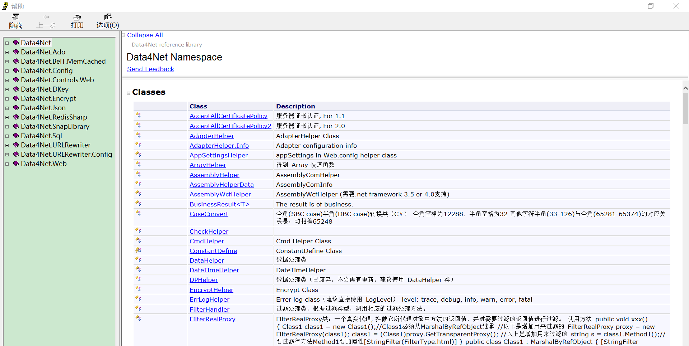

Data4Net
===
---

Data4Net 3.X (.NET Framework 4.6.1)
* 增加 Data4Net.Standard 类库，基于 .Net Standard 1.4 编译。
---

Data4Net 2.X (.NET Framework 2.0)
* 基于 framework 2.0 最后一个版本号2.500.22，之后将使用基于 framework 4.6.1 的版本编译。
---

文档
* [帮助文档 - 在线浏览](Document/Data4Net.md)
* [帮助文档 - xml](Document/Data4Net.xml)
* [帮助文档 - chm](Document/Data4Net-2.400.14.0.chm)

---

Powered by MARS  
2018.09.11
  
  

附录：帮助文档

